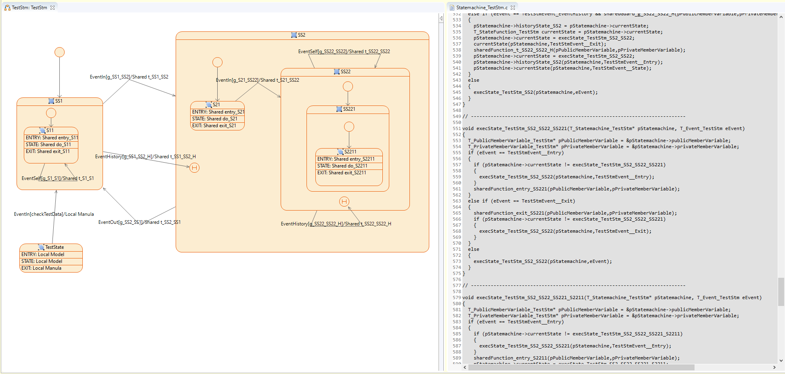
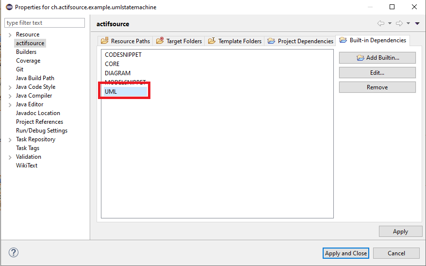

# UML Statemachine
In this project we will show how to use the built-in uml statemachine.

## UML Built-In
Define the UML built-in

## Requirements
Actifsource Workbench Enterprise Edition

## License
[http://www.actifsource.com/company/license](http://www.actifsource.com/company/license)

